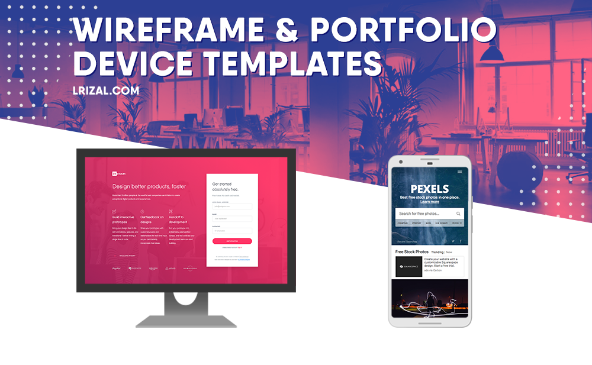

This set of png and Illustrator frames serve as easy-to-use elements for wireframing and displaying your work on a portfolio. These are total freebies, but any name-drops for my website are encouraged:<b> [lrizal.com](http://www.lrizal.com/)</b>

 ## Models Based On:
 Newer models were used since I focused on these for presentation reasons. They are- iPhone, iPhone X, Galaxy 9, Google Pixel 2, iMac 2018, Dell UltraSharp, iPad Pro 2018

 ## How to Use:
Screencap your app with the device type previewed. Copy and paste it under the frame (with a photo-editor of your choosing) and you're ready to roll. 